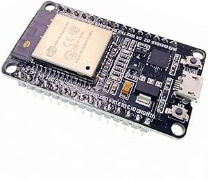
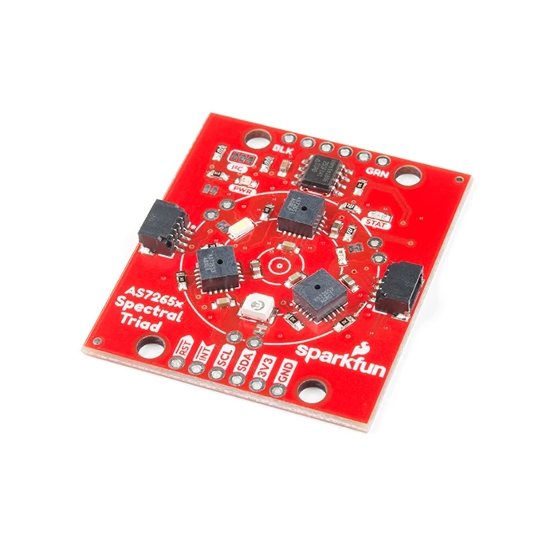
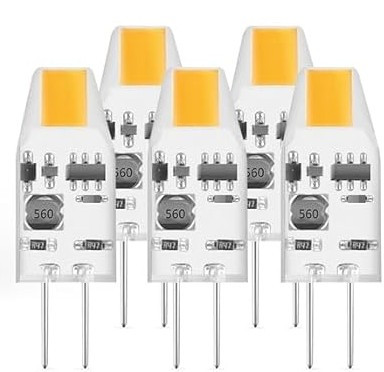

# Triad Spectrophotometer – Open-Source UV-Vis

> A low-cost, portable, and open-source spectrophotometer for absorbance and transmittance measurements from 410 nm to 940 nm, based on the SparkFun AS7265x sensor and ESP32.


## 🔬 Scientific Background

Your project aligns with the growing trend of **democratizing spectroscopy** for environmental monitoring, education, and citizen science. As highlighted in recent literature:

- Portable spectrophotometers enable **real-time water quality analysis** (e.g., chlorophyll, nitrates, microplastics).
- The **Beer-Lambert law** forms the basis for quantitative analysis:  
  \( A = \log_{10}(I_0/I) = \epsilon \cdot c \cdot l \)
- Open-source designs reduce costs from thousands to **under $100**, while maintaining scientific validity.

This device is ideal for:
- Quantifying bioindicators (e.g., algae via chlorophyll absorbance)
- Detecting chemical pollutants
- Educational labs in chemistry and environmental science

---

## 🧪 Features

- ✅ **Dual-mode**: Absorbance & Transmittance (%)
- ✅ **18-channel spectral range**: 410–940 nm (UV-Vis-NIR)
- ✅ **Hardware-synchronized LED control** (external light source)
- ✅ **Stable measurements**: 5s LED warm-up + 10-reading average
- ✅ **User-friendly GUI**: Port selection, sample naming, real-time plotting
- ✅ **Export-ready**: CSV (with I₀, I, A, %T) and publication-quality PNG
- ✅ **Cross-platform**: Windows, Linux, macOS executables via GitHub Actions

---

## 📦 Bill of Materials (BOM)

| Component | Description | Photo | Where to Buy |
|----------|-------------|-------|--------------|
| **ESP32 Dev Board** | Microcontroller with Wi-Fi/Bluetooth, used for sensor control and serial communication. |  |[Amazon](https://www.amazon.com.be/-/en/JZK-ESP-32S-Development-Antenna-Bluetooth/dp/B071JR9WS9/ref=sr_1_6?crid=2U54IO4IFJO0Q&dib=eyJ2IjoiMSJ9.y1CNdrXF6hE88p_-wC7iTI8SLWXBiJfkModadyIfdh3DQ0cjlF3B9g1Qeh3Gc6S5v5APWlvGeXW7X5naNVgxJQ5aCHafjdbTumwdoJqyRPBEnceLNJW7v_yY7fQ5p8mt1TQH9AanBYdDeM86XFai-B-womxRmXlEfN2xlmqhn-fr9qft-7DYI3U3rAUi-JBiDtqbyrArC86hFx0310qy6tJ16B4AqjNUqFDC_oXfb8BrZhyRkXXWd_x86fcNUMKCHU2IhFq3GBVEm5R1WqnqOsej1Od0LMdgOTFOTL8JRXU.na4_UdmfhEOFqe9n11kAvkcSe_YBR9J2HWHsQ5e7ibY&dib_tag=se&keywords=esp32&qid=1760725701&sprefix=esp32%2Caps%2C86&sr=8-6) |
| **SparkFun Triad - AS7265x** | 18-channel spectral sensor (410–940 nm), with factory calibration in µW/cm². |  | [SparkFun](https://www.sparkfun.com/sparkfun-triad-spectroscopy-sensor-as7265x-qwiic.html) |
| **External White LED** | High-intensity light source for transmission measurements (connected to GPIO 32). |  | [Amazon](https://www.amazon.com.be/-/en/advantage-voltage-replaces-non-dimmable-ultra-compact/dp/B0DJW19DG5/ref=sr_1_30?crid=1UUQJEJJFC3TF&dib=eyJ2IjoiMSJ9.rLCxTtHnM2iWqSUDvJIGQl5aakWf4WHQE_G4lsQLxTIcgym45dIFysddKrctMs0GjkWRhLwr-bbXTdKsEdBrCEbOKyARRnSNkYqEWRvbJHMiJi_hsBRnj2AfE4qwM-YKxBNr1HAE2L6WlixA1suC6vcuKZyQJVeG8aFcVOIHTy-Hcl2BTMnVvhlTPsU_21o3jtBbDxpJumecu0hjoBXkHxPrNQ8TTiozy6W5O-PJIM1VvooZX9rZ0wSnm5vr4rYKpfxcdPJ1DI4QSqOD66nc7ccFS4i1cQBeUHB67Y08aQ0.vWlxceeyIRkaN6-Yp0YW1YX7KfqNhIQwtWslJyjlDwU&dib_tag=se&keywords=led%2Bosram&qid=1760725877&sprefix=led%2Bosram%2Caps%2C129&sr=8-30&th=1) |
| **Cuvette Holder** | 3D-printed or acrylic holder for standard 10 mm pathlength cuvettes. |  | [Amazon](https://www.amazon.com.be/-/en/dp/B086JLHZX5/ref=sr_1_3?crid=3K2OL5YWO7SG5&dib=eyJ2IjoiMSJ9.BrnqEjAP6T9TrZo6-NLM5tuqz--UnIYaMlSprFDDiBr4M1x_ppyC9e7vsjaXmAY074hVTb_ZOTqK7gfk5kghz5jZSgkM0R15_i4dG-P27saj7xpu3v0P8uPhIGYqhWPIQNIIcz_6vi_lyoB1ktP0lZ2SpAy_Ho3rvjen6qAl3dNnNOmE6eukyPC7VYAOO_A77S05tYXAqE_Aq7TtNLAOVYB9cvfF8vV698mqP3sOBg7w0fzB5BIFSc5tSA4h-wSvkS76Go4I5acConm0j08l9RDeE8XFIT-ATerkt4lAXCo.l7B6cizw5cRWQ2f0odv5mcMIcESM2DtDwDbPEetLPd0&dib_tag=se&keywords=quartz%2Bcuvettes&qid=1760726108&sprefix=quartz%2Bcuvettes%2Caps%2C59&sr=8-3&th=1) |

---

## 🚀 Getting Started

### Option 1: Download Executable (Recommended for users)
1. Go to **[Releases](https://github.com/your-username/your-repo/releases)**
2. Download the appropriate version:
   - `spectrophotometer.exe` → Windows
   - `spectrophotometer` → Linux
   - `spectrophotometer.app` → macOS
3. Install USB drivers if needed (CH340/CP210x)
4. Run the executable and follow the GUI instructions

### Option 2: Run from Source (For developers)
```bash
git clone https://github.com/your-username/your-repo.git
cd your-repo
pip install -r requirements.txt
python spectrophotometer.py
