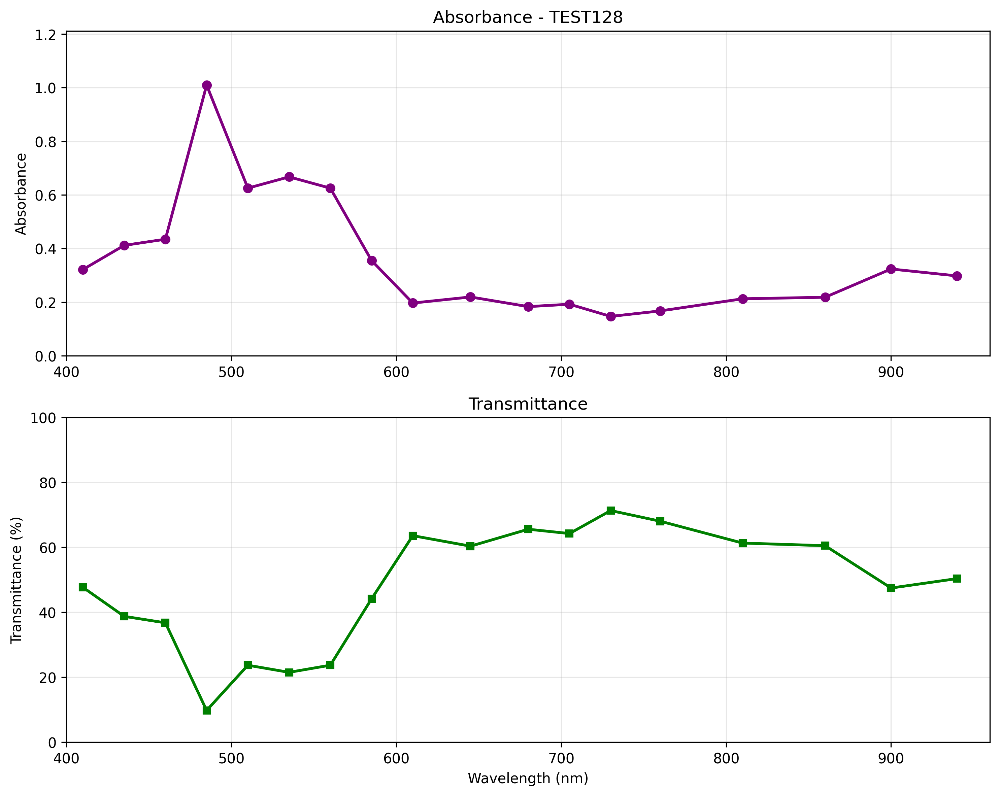

# Triad Spectrophotometer – Open-Source UV-Vis-NIR Analyzer

> A low-cost, portable, and open-source spectrophotometer for absorbance and transmittance measurements from 410 nm to 940 nm, based on the SparkFun AS7265x sensor and ESP32.



## 📸 Gallery

| Reference Measurement | Sample Measurement | Absorbance + Transmittance |
|:--------------------:|:------------------:|:--------------------------:|
|  |  |  |

> **Note**: Replace the placeholder images with your actual screenshots.

---

## 🔬 Scientific Background

Your project aligns with the growing trend of **democratizing spectroscopy** for environmental monitoring, education, and citizen science. As highlighted in recent literature:

- Portable spectrophotometers enable **real-time water quality analysis** (e.g., chlorophyll, nitrates, microplastics).
- The **Beer-Lambert law** forms the basis for quantitative analysis:  
  \( A = \log_{10}(I_0/I) = \epsilon \cdot c \cdot l \)
- Open-source designs reduce costs from thousands to **under $100**, while maintaining scientific validity.

This device is ideal for:
- Quantifying bioindicators (e.g., algae via chlorophyll absorbance)
- Detecting chemical pollutants
- Educational labs in chemistry and environmental science

---

## 🧪 Features

- ✅ **Dual-mode**: Absorbance & Transmittance (%)
- ✅ **18-channel spectral range**: 410–940 nm (UV-Vis-NIR)
- ✅ **Hardware-synchronized LED control** (external light source)
- ✅ **Stable measurements**: 5s LED warm-up + 10-reading average
- ✅ **User-friendly GUI**: Port selection, sample naming, real-time plotting
- ✅ **Export-ready**: CSV (with I₀, I, A, %T) and publication-quality PNG
- ✅ **Cross-platform**: Windows, Linux, macOS executables via GitHub Actions

---

## 📦 Bill of Materials (BOM)

| Component | Description | Photo | Where to Buy |
|----------|-------------|-------|--------------|
| **ESP32 Dev Board** | Microcontroller with Wi-Fi/Bluetooth, used for sensor control and serial communication. |  | [AliExpress](https://...) / [Amazon](https://...) |
| **SparkFun Triad - AS7265x** | 18-channel spectral sensor (410–940 nm), with factory calibration in µW/cm². |  | [SparkFun](https://www.sparkfun.com/products/15050) |
| **External White LED** | High-intensity light source for transmission measurements (connected to GPIO 32). |  | [Amazon](https://...) |
| **USB Cable** | For power and data transfer (ensure it supports data, not just charging). |  | Any retailer |
| **(Optional) Cuvette Holder** | 3D-printed or acrylic holder for standard 10 mm pathlength cuvettes. |  | [Printable on Thingiverse](https://...) |

> **Note**: Upload your own photos to an `images/` folder in the repo and update the links.

---

## 🚀 Getting Started

### Option 1: Download Executable (Recommended for users)
1. Go to **[Releases](https://github.com/your-username/your-repo/releases)**
2. Download the appropriate version:
   - `spectrophotometer.exe` → Windows
   - `spectrophotometer` → Linux
   - `spectrophotometer.app` → macOS
3. Install USB drivers if needed (CH340/CP210x)
4. Run the executable and follow the GUI instructions

### Option 2: Run from Source (For developers)
```bash
git clone https://github.com/your-username/your-repo.git
cd your-repo
pip install -r requirements.txt
python spectrophotometer.py
