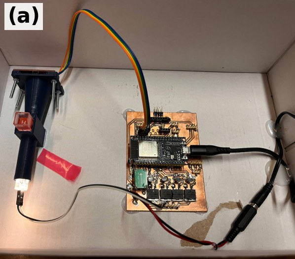
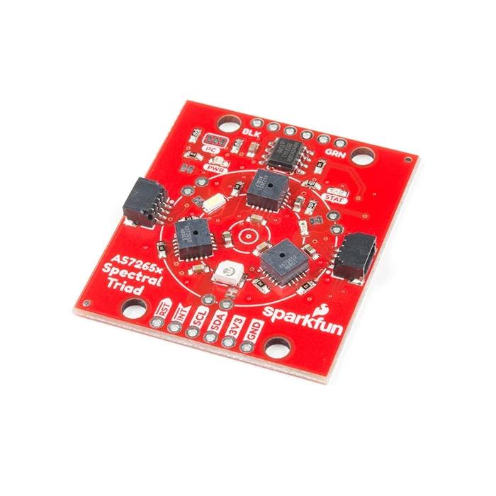
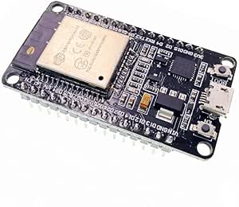
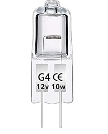
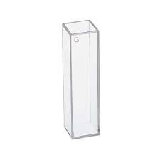

# System A – AS7265x multispectral spectrophotometer

Firmware and control software for **System A** of the article

> A. M. Rivera-Rivera, D. Martinez-Ortiz, F. Quitin, D. Terwagne, S. C. Nicolis, E. Altshuler, A. Campo,
> *Low-Cost Spectrophotometers: A Comparative Evaluation of Open-Source Architectures* (2026), arXiv:XXXX.XXXXX.

System A is a low-cost, portable absorbance/transmittance spectrophotometer built around the
SparkFun Triad AS7265x sensor (18 discrete channels, 410–940 nm, ~20 nm FWHM) and an ESP32
microcontroller. A 10 W halogen lamp transmits light through a standard 10 mm cuvette onto the
sensor; a Python program on the host computer switches the lamp, acquires the spectra, and
computes absorbance and transmittance.



*System A: AS7265x sensor in a 3D-printed structure, controlled by an ESP32 (Fig. 1a of the article).*

---

## Repository layout

```
firmware/Spectro18_V1/   Arduino sketch for the ESP32
software/                Host acquisition program (Python, GUI)
hardware/                3D-printable parts and wiring diagram
images/                  Pictures used in this README
.github/workflows/       CI that builds standalone executables (PyInstaller)
```

---

## Bill of materials

Costs as reported in Table IV of the article (EUR, approximate).

| Component | Description | Photo | Cost (€) |
|-----------|-------------|-------|---------:|
| **SparkFun Triad AS7265x** | 18-channel spectral sensor (410–940 nm), Qwiic/I²C. [SparkFun](https://www.sparkfun.com/sparkfun-triad-spectroscopy-sensor-as7265x-qwiic.html) |  | 65.00 |
| **ESP32 development board** | Microcontroller; talks to the sensor over I²C and to the PC over USB serial. |  | 8.00 |
| **3D-printed enclosure + accessories** | Sensor/lamp/cuvette alignment structure ([`hardware/system-a-enclosure.stl`](hardware/system-a-enclosure.stl)). | | 10.00 |
| **Wiring, PCB, power supply** | Jumper wires, lamp switch, USB cable, supply. | | 5.00 |
| | | **Total** | **88.00** |

Not included in the total (as in the article):

| Item | Notes |
|------|-------|
| **10 W halogen lamp** | Light source used for all measurements in the article. Switched by the ESP32 (GPIO 32) through a relay module.  |
| **10 mm optical cuvettes** | Standard plastic cuvettes.  |
| Host computer | Windows, macOS or Linux, with a free USB port. |

---

## Wiring

| ESP32 pin | Connected to | Notes |
|-----------|--------------|-------|
| 3V3 | AS7265x 3.3V | Qwiic red wire |
| GND | AS7265x GND, lamp switch GND | Common ground |
| GPIO 21 (SDA) | AS7265x SDA | Default ESP32 I²C bus |
| GPIO 22 (SCL) | AS7265x SCL | Default ESP32 I²C bus |
| GPIO 32 | Lamp switch input (e.g. relay module) | **Active-low**: `LOW` = lamp on, `HIGH` = lamp off |

The on-board LEDs of the AS7265x are not used; only the external halogen lamp illuminates the sample.
Place the lamp, the cuvette and the sensor on one optical axis inside the enclosure and keep the
whole set-up in darkness during measurements.

---

## Installation

### 1. Firmware (ESP32)

1. Install the [Arduino IDE](https://www.arduino.cc/en/software) (2.x) and the **esp32** board package by Espressif.
2. Install the **SparkFun AS7265X Arduino Library** from the Library Manager.
3. Open `firmware/Spectro18_V1/Spectro18_V1.ino`, select your ESP32 board and port, and upload.
4. Open the Serial Monitor at **115200 baud**: the board prints `LISTO` and then one line of
   18 comma-separated calibrated channel readings (µW/cm²) per measurement, ordered by wavelength.

Serial commands accepted by the firmware:

| Command | Effect | Reply |
|---------|--------|-------|
| `LIGHT_ON`  | Switches the lamp on  | `LUZ_ENCENDIDA` |
| `LIGHT_OFF` | Switches the lamp off | `LUZ_APAGADA` |

### 2. Host software

**Option A – standalone executable.** Download the build for your OS from the repository
*Releases* page (built automatically by `.github/workflows/build.yml` for every `v*.*.*` tag).
Install the USB-serial driver of your ESP32 board (CP210x or CH340) if the port does not appear.

**Option B – from source** (Python 3.10–3.12):

```bash
git clone https://gitlab.com/fablab-ulb/projects/cuban-water-lab/spectrophotometer-software.git
cd spectrophotometer-software
python -m venv env && source env/bin/activate      # Windows: env\Scripts\activate
pip install -r requirements.txt
python software/spectrophotometer.py
```

---

## Usage

1. Connect the ESP32 by USB and start the program. Select the serial port in the dialog.
2. **Take Reference.** Insert a cuvette with the blank (solvent, e.g. distilled water) and click
   *Take Reference*. The lamp is switched on, allowed to stabilise for 5 s, ten valid readings are
   averaged (I₀), and the lamp is switched off.
3. **Measure Sample.** Replace the blank with the sample and click *Measure Sample*. Ten readings
   are averaged (I) and the program plots, for the 18 channels,
   - absorbance A = log₁₀(I₀ / I)
   - transmittance T = 100 · I / I₀ (%)
4. **Save.** Click *Save* and enter a sample name to write a CSV and a PNG.
5. **Measure Error** (optional). Takes ten consecutive readings of the sample in the cuvette and saves
   every individual absorbance spectrum plus their mean and standard deviation, to assess repeatability.

If a file named `calibration_factor.npy` (18 multiplicative factors, one per channel) is present in
the working directory, the absorbance is multiplied by it; otherwise a factor of 1 is used.

### Output files

Files are written to `~/Descargas/Spectra_Absorbance_CSV/` and `~/Descargas/Spectra_Absorbance_PNG/`
(the folder name is set in `software/spectrophotometer.py`).

`<name>_<YYYYMMDD_HHMMSS>.csv` (one row per channel):

| Column | Unit | Meaning |
|--------|------|---------|
| `Wavelength_nm` | nm | Channel centre wavelength |
| `I0_Reference_uW_per_cm2` | µW/cm² | Mean reference (blank) reading |
| `I_Sample_uW_per_cm2` | µW/cm² | Mean sample reading |
| `Absorbance_Calibrated` | AU | log₁₀(I₀/I) × correction factor (factor = 1 if none is loaded) |
| `Transmittance_%` | % | 100 · I/I₀ |

`error_measurement_<YYYYMMDD_HHMMSS>.csv`: `Wavelength_nm`, `I0_Reference_uW_per_cm2`,
`Absorbance_Reading_1` … `Absorbance_Reading_10`, `Absorbance_Mean`, `Absorbance_Std`.

---

## How to cite

If you use this design or software, please cite the article above. Citation metadata is provided in
[`CITATION.cff`](CITATION.cff).

## Licence

Released under the [MIT License](LICENSE).

## Acknowledgements

Developed within the project *“In situ monitoring of water quality in Cuban bays: creating and
promoting the use of a scientific toolbox”*, supported by ARES with funding from the Belgian
Development Cooperation, at the Innovation Laboratory (CUJAE, Havana) and Fab Lab ULB (Université
libre de Bruxelles). A. C. and S. C. N. acknowledge funding from the European Union's Horizon Europe
research and innovation programme under grant agreement No. 101181363 (BioDiMoBot).
We thank Axel Cornu for valuable advice.
